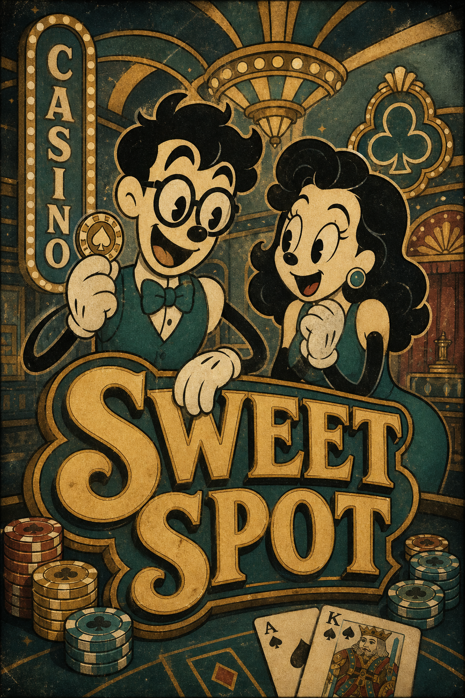
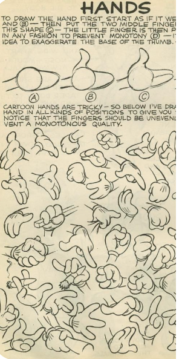
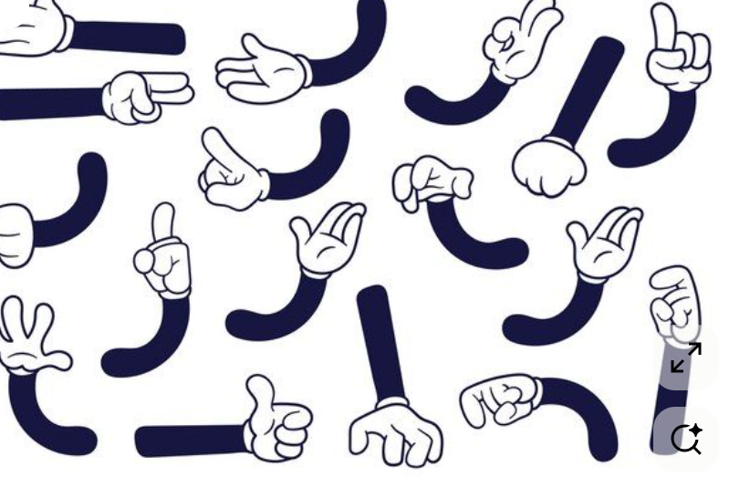
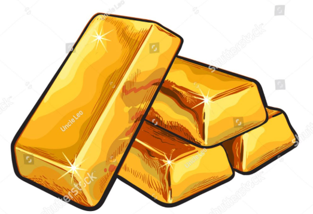
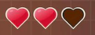
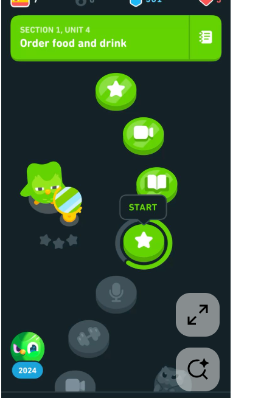
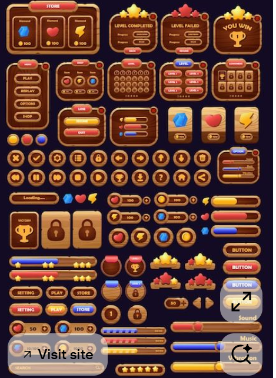

# Sweet Spot Canonical Moodboard

**Status:** Canonical  
**Parent guide:** [`docs/art-style-guide.md`](../art-style-guide.md)

This is the only approved moodboard list for new Sweet Spot artwork. Files or
mockups not listed here are exploratory and must not be used as style references
without first updating this document.

## Approved References

### 1. Character and title-card direction

File: `docs/moodboard/references/sweet-spot-1930s-hero.png`

Use it for:

- pie-cut eye construction;
- white period animation gloves;
- rubber-hose arms;
- bean-shaped faces and simple noses;
- variable hand-inked outlines;
- muted teal, antique gold, cream, and warm black;
- Art Deco casino staging;
- flat cel paint, paper tooth, film grain, and registration imperfection;
- the hero's “chip in one hand, other hand on the title” pose.

Do not copy:

- exact facial proportions for every character;
- the specific layout for every screen;
- text rendered inside generated imagery.

### 2. Canonical cream clay chip

File: `my-expo-app/assets/brand/chips/chip-3q.png`

The same sprite set covers:

- reward rain;
- jackpots;
- stage-completion celebrations;
- streak milestones;
- Peek and Pitch table stacks (`chip-edge.png` slices under a `chip-face.png` cap);
- HUD Chip lives (`chip-face.png` / `chip-face-empty.png`).

Geometry constants live in `my-expo-app/theme/chipArt.ts`. A composited look
target is `docs/moodboard/references-art-style/chip-redesign-target.png`.

### 3. Brand tokens

File: `my-expo-app/theme/artStyle.ts`

Use it for:

- canonical style name;
- runtime color tokens;
- links to approved app assets;
- motion principles used by components.

The written detail in `docs/art-style-guide.md` takes precedence if code and docs
temporarily drift.

## Era References (Principles, Not Characters)

Reference the production language of early theatrical animation:

- hand-inked black contours;
- pie-cut eyes;
- rubber-hose limbs;
- white animation gloves;
- painted cels over gouache/watercolor backgrounds;
- title-card lettering and Art Deco marquee design;
- limited palettes and visible film texture;
- strong key poses animated on 2s.

These are era conventions. Do not imitate or trace a recognizable copyrighted
character, logo, scene, or silhouette.

## Canonical Character Rules

Every recurring character must have:

1. a simple silhouette readable at phone size;
2. pie-cut eyes;
3. period gloves whenever hands are visible;
4. rubber-hose curves rather than realistic elbow/knee anatomy;
5. one identifiable poker or learning prop;
6. a front, three-quarter, side, and expression sheet before final animation;
7. a clear role in the learning journey.

The current hero archetype is a wholesome poker nerd: clear glasses, sweater
vest, bow tie, curiosity, and warmth. “Clever” must never become “slick casino hustler.”

## Construction Libraries (Anatomy, Not Heroes)

These sheets teach **how to draw** Sweet Spot characters. They do not replace the
canonical hero poster. Do not copy any figure, costume, or face from them into
the app as a mascot.

### 4. Glove-hand construction tutorial

File: `docs/moodboard/references/construction-glove-hands-tutorial.png`

Use it for:

- palm-as-circle, then thumb, then three sausage fingers;
- exaggerated thumb base;
- uneven finger spacing;
- four-digit gloves with optional back-of-hand stitch marks;
- handshake, pointing, fist, and object-grip keys.

Do not copy:

- cigars or other props that are not part of Sweet Spot;
- any labeled tutorial lettering into UI.

### 5. Full glove pose library

File: `docs/moodboard/references/hands-pose-library-full.png`

Use it for: 360° glove angles, pointing, peace/OK, fists, reach, and rest poses.

Do not copy: peace/OK as product icons unless a specific interaction needs them.
Keep Sweet Spot gestures tied to cards, chips, teaching, and celebration.

### 6. Cuffed gesture set (UI scale)

File: `docs/moodboard/references/hands-gesture-set-cuffed.png`

Use it for: compact thumbs-up / thumbs-down / point / palm / fist silhouettes
that still read at badge and feedback size.

Do not copy: using these as a generic sticker pack on every screen.

### 7. Navy hose arms + cream gloves

File: `docs/moodboard/references/arms-navy-white-gloves.png`

Source overlap: [this Pinterest pin](https://pin.it/7CGQVhAXg) is the same class
of sheet (isolated cartoon arms in gloves). Keep one copy; do not add duplicates.

Use it for:

- arm as a jointless ink tube;
- cream cuff where glove meets sleeve;
- high-contrast navy limb / cream glove fill.

Do not copy: navy as the only allowed skin/sleeve color. Sweet Spot sleeves follow
the teal/cream/tobacco wardrobe of the hero poster.

### 8. Expression sheet (24 faces)

File: `docs/moodboard/references/faces-expression-sheet-24.png`

Use it for: pie-cut eyes, graphic mouths, readable emotion at small size.

Do not copy: mustaches, “damsel” lash sets, or any face as a new recurring character.

### 9. Modular feature kit (eyes / nose / mouth)

File: `docs/moodboard/references/faces-feature-kit-modular.png`

Use it for: mixing idle / think / miss / celebrate features onto existing heads.

Do not copy: placing floating features on objects as the default UI language.

### 10. Body-proportion construction

File: `docs/moodboard/references/construction-body-proportions.png`

Use it for: large gloves, large shoes, noodle limbs, circle heads, adult vs compact
proportions, and simple masculine / feminine / round / thin silhouettes.

Do not copy: turning Sweet Spot into stickmen, or imitating any recognizable
studio mouse proportions.

### 11. Era street scene (atmosphere only)

File: `docs/moodboard/references/era-street-scene-film-grain.png`

Use it for: newsreel grain, pie-cut eyes in a full-body walk, period street depth,
gloved hands in costume.

Do not copy: the boy, the bear extra, the newsboy outfit, or the specific street.
This is **not** a Sweet Spot character sheet.

### 12. Hose legs and shoes (shaded)

File: `docs/moodboard/references/construction-hose-legs-shoes-shaded.png`

Use it for: jointless black hose legs, oversized cream shoes, ankle cuffs, walk /
run / jump / skid keys, simple cel shade on the shoe.

Do not copy: turning every character into Mickey-style two-tone shoes, or using
pure black legs as the only allowed sock/pant color.

### 13. Hose legs and shoes (line)

File: `docs/moodboard/references/construction-hose-legs-shoes-line.png`

Use it for: the same lower-body grammar in cleaner line art (stand, cross, kick,
high step). Prefer this sheet when generating ink-only keys.

Do not copy: stock watermarks, or tracing a specific pair into a hero sprite.

## The Peek and Pitch (cartoon keys)

These are the canonical **drawn** gestures for Template 1. Prefer them over the
photoreal camera photos when generating or reviewing Level 1 art.

### 14. Glove sliding a card packet

File: `docs/moodboard/references/peek-glove-slide-cards-sepia.png`

Use it for: four-digit cream glove, hose arm, cards as a short stack on wood,
ornate card backs as period pattern language, inky chips on the table.

Do not copy: the sleeping bulldog, the bartender, the shot glass, or a full-sepia
app palette. Sweet Spot stays teal / gold / cream.

### 15. Corner-lift peek (primary Peek key)

File: `docs/moodboard/references/peek-glove-corner-lift-card.png`

Use it for: thumb + finger pinching the near corner, one rank/suit revealed,
the rest of the card still down. This is the long-press Peek pose.

Do not copy: Mickey-proportion gloves as a character, or that exact King of Clubs
engraving.

### 16. First-person Peek at hole cards

File: `docs/moodboard/references/peek-glove-pov-hole-cards.png`

Use it for: look-down table, two hole cards curled toward the player, other
players as white-glove extras only, chip stacks between the player and the board.

Do not copy: yellow gloves (ours are animation cream), “POKER” chip labels, or
photoreal navy felt as the default table.

### 17. Glove reaching chip stacks (Pitch / chip action)

File: `docs/moodboard/references/pitch-glove-reach-chip-stacks.png`

Use it for: hose arm into a cream glove, grab or hover over inked chip stacks,
dealer-tray rows in the background. Use for chip commit / Pitch energy, not Peek.

Do not copy: a chip-only frame as the Peek (Peek must show cards).

## Peek and Pitch camera (photoreal, limited)

These photos are **camera and table blocking only**. They do not change character
art, palette, or chip rendering. Draw the peek from the cartoon keys above.

### 18. Hole-card peek on dark felt

File: `docs/moodboard/references/peek-pov-hole-cards-felt.png`

Use it for: first-person look-down, two hole cards lifted at the near corner,
chips stacked just beyond the cards, shallow focus toward the table.

### 19. Peek plus community board

File: `docs/moodboard/references/peek-pov-board-and-hole-cards.png`

Use it for: how the board sits farther away than the hole cards; keep the player's
cards large in the foreground.

### 20. Warm lamplight peek (VIP mood)

File: `docs/moodboard/references/peek-pov-warm-lamplight-limited.png`

Use it for: low-key amber light, cream card stock, wood grain as a VIP-room clue.

### 20a. Transparent physical packet silhouette

File: `docs/moodboard/references-art-style/peek-real-life-gemini-transparent.png`

Use it for: the broad C-curve of two cards lifted together, 15–20% overlap,
rounded card corners, upright corner indices, and the near-edge pinch location.

Do not ship or trace the photoreal hand, fixed A-spade/A-diamond values, or
photographic card texture. Runtime cards use the dynamic card templates and the
Sweet Spot cream cartoon glove.

Do not copy from any Peek photo: real hands, watches, modern card faces, whiskey,
or a photoreal felt texture as the app's default look.

## Table layout (limited)

### 21. Betting-zone felt layout

File: `docs/moodboard/references/table-layout-betting-zones-limited.png`

Use it for: symmetric player spots, color-coded zones, payout text that stays
readable on felt, a fanned deck as a centerpiece.

Do not copy: the crimson “casino red” palette, Three Card Prime branding, or
printing dense payoff tables into Sweet Spot UI. Our tables stay teal / cream /
gold and teach poker, they do not host that game.

## Illustrated chips (in-scene)

### 22. Woodcut chip stacks

File: `docs/moodboard/references/chips-illustrated-woodcut-stacks.png`

Use it for: inked stacks with hatched shade and checkered rims — the language for
chips inside cartoons, not the falling 3D reward.

### 23. Chip angles: line vs hatch

File: `docs/moodboard/references/chips-illustrated-angles-line-and-hatch.png`

Use it for: top, tilt, edge, and stack construction. Prefer the **left (clean
line)** for icons; the **right (hatch)** for poster texture.

Do not copy: blue ballpoint sketch as the final fill color.

### 24. 3D chip turnaround (reward exception only)

File: `docs/moodboard/references/chips-3d-turnaround-reward-exception.png`

Use it for: tilt and edge-on angles of the **already approved** tactile 3D
reward chip.

Do not copy: red/blue/green plastic casino colors, or using this grid for
character-scene chips.

---

## HUD, economy, and level-map UX (layout only)

These sheets answer **structure and hierarchy** questions for the top bar, Gold
Coins, Chip Stack lives, streak, and stage progression map. They are **not**
character, world, or palette authority. Translate every chrome piece into the
1930s rubber-hose / wood / parchment language from the guide above.

Canonical product mapping (from `docs/mvp.md`):

| HUD idea in these refs | Sweet Spot equivalent |
| ---------------------- | --------------------- |
| Hearts / lives         | **Chip Stack** (3 poker chips) |
| Gold coins / gold bars | **Gold Coins** (Daily Challenge currency) |
| Flame / energy         | Streak (or energy cue) — not Chip lives |
| Level path nodes       | Sequential stage unlock on a track map |

### A. Gold Coins iconography

#### 25. Gold bars — sparkle stack (primary bar icon)

File: `docs/moodboard/references/currency-gold-bars-sparkle-stack.png`

Use it for: bold outlined gold-bar silhouette, stacked volume, star glints for
“valuable.” Prefer this over photoreal bullion for HUD icons.

Do not copy: Shutterstock / “Uncle Leo” watermarks, neon-yellow plastic fill, or
using bars as Chip Stack lives (lives are poker chips).

#### 26. Gold bars — muted ingot (secondary / quieter icon)

File: `docs/moodboard/references/currency-gold-bars-ingot-muted.png`

Use it for: softer tan/cream cel bars when the sparkle stack feels too loud;
simple stack of three with one diagonal on top.

Do not copy: stamped codes like `399B`, or replacing Antique Gold / Lamp Gold
with beige-only metals.

#### 27. Gold coin tier piles (reward amounts)

File: `docs/moodboard/references/currency-gold-coins-tier-piles.png`

Use it for: small → medium → large pile progression, coin + bar mixtures for
bigger rewards, “overflowing container” as a jackpot beat.

Do not copy: `$` stamp as the coin face (prefer Sweet Spot chip/monogram
language), red briefcase, or modern safe as a permanent HUD icon.

### B. Chip Stack lives and streak

#### 28. Three lives filled / empty (layout)

File: `docs/moodboard/references/hud-chip-lives-hearts-filled-empty.png`

Use it for: **three slots in a row**, filled vs empty contrast, thick light
outline so lives read on dark wood/HUD.

Do not copy: **hearts**. Sweet Spot lives are **poker chips** (see Chip Stack in
MVP). Red heart silhouettes are the pattern only.

#### 29. Streak flame badge

File: `docs/moodboard/references/hud-streak-flame-badge.png`

Use it for: a single readable flame inside a rounded badge; thick ink outline;
cel red/orange layers (not photoreal fire).

Do not copy: putting the flame in the Chip Stack slot, or making streak compete
with Gold Coins for the same HUD position.

### C. Top HUD chrome (composition)

#### 30. Casual main-menu HUD layout

File: `docs/moodboard/references/hud-casual-main-menu-layout.png`

Use it for: top-left avatar, currency pill + lives pill, one dominant PLAY CTA,
side rails for secondary features, bottom mode tab.

Do not copy: Match Masters branding, wood-grain stock UI, glossy candy buttons,
notification-dot spam, or modern casual-puzzle art as Sweet Spot’s look.

#### 31. Casual top-bar crop

File: `docs/moodboard/references/hud-casual-top-bar-layout.png`

Use it for: compact reading of avatar | currency | lives | settings in one row.

Do not copy: the specific icon art or saturated candy palette.

### D. Stage / level progression maps

Prefer **sequential path + clear current node** over open branching (MVP map is
stage unlock, not free roam). World art stays Benny's Garden / casino / VIP —
not candy land or pixel Mario islands.

#### 32. Pixel island path (path + landmarks)

File: `docs/moodboard/references/map-pixel-island-path.png`

Use it for: winding path through a themed world, landmarks as section markers,
player token on the path.

Do not copy: 16-bit Mario art, pipes, or Nintendo characters. Pixel is not our
render style — only the **map grammar**.

#### 33. Locked vs current nodes (whimsical path)

File: `docs/moodboard/references/map-whimsical-locked-nodes.png`

Use it for: bright “current” node vs grey locked nodes with padlocks; dashed
path; avatar pin above the active stage.

Do not copy: candy/circus props, pastel purple skinning, or kawaii mascots.

#### 34. Educational winding path + side tools

File: `docs/moodboard/references/map-edu-winding-path-nodes.png`

Use it for: vertical scroll path, star nodes for completed stages, lock nodes,
treasure markers, unit/section signpost.

Do not copy: Chinese UI chrome, mystery building silhouettes as the default, or
flat modern edu-app illustration as world art.

#### 35. Vertical learning-path nodes (primary map UX)

File: `docs/moodboard/references/map-learning-path-vertical-nodes.png`

Use it for: completed / current / locked node states, one strong START cue on
the current stage, section header, currency + lives in the status strip.

Do not copy: Duolingo owl, lime flat UI, or modern mascot path art. Already
listed as non-canonical for characters — this sheet is **node-state UX only**.

#### 36. Quest book pages (themed container)

File: `docs/moodboard/references/map-quest-book-pages.png`

Use it for: stages presented inside a book/spread metaphor; numbered nodes with
topic icons; left/right page navigation.

Do not copy: neon magic purple UI, Halloween props, or packing dense fantasy
chrome into Sprint 1.

#### 37. Parchment quest log (warm path card)

File: `docs/moodboard/references/map-parchment-quest-log.png`

Use it for: parchment + wood frame for a stage list, numbered circles, star
rating under a stage, dashed journey line.

Do not copy: skull motifs, fantasy dungeon props, or making every screen a quest
log. Closest cousin to our tobacco/cream period materials — still translate to
casino-garden, not RPG loot.

### E. UI kits (chrome vocabulary)

Use kits for **button shapes, frames, resource bars, and icon silhouettes**.
Redraw in period ink; do not ship stock kit PNGs.

#### 38. Parchment + bars + icons kit

File: `docs/moodboard/references/ui-kit-parchment-buttons-icons.png`

Use it for: book/notepad frames, striped banners, pill buttons, coin/star
currency marks, flat utility icon row.

Do not copy: bomb/magnet power-up stickers, Facebook marks, or rainbow candy
fills as brand color.

#### 39. Glossy circular button grid (states only)

File: `docs/moodboard/references/ui-kit-glossy-circular-buttons.png`

Use it for: same icon across color states (info / success / warn / danger).

Do not copy: bubble gloss, glass bevels, or saturating every control in four
candy colors. Sweet Spot buttons stay matte/cel with one lamp-gold CTA.

#### 40. Fantasy RPG parchment kit (materials)

File: `docs/moodboard/references/ui-kit-fantasy-rpg-parchment.png`

Use it for: torn parchment windows, wood boards, wax seals, zone/path strip,
resource icons on rustic panels.

Do not copy: inventory hex grids, RPG character cards, or skull/adventure
branding. Borrow **paper + wood**, not dungeon fantasy.

#### 41. Rustic wood chrome kit (closest HUD cousin)

File: `docs/moodboard/references/ui-kit-rustic-wood-chrome.png`

Use it for: wood-framed panels, PLAY/STORE headers, heart/coin/energy resource
bars, lock badges, star ratings, win/lose frames.

Do not copy: diamond gem currency (we use Gold Coins), glossy candy CTAs, or
shipping this kit’s art unchanged. Remap hearts → chips, gems → gold bars/coins,
and recolor to teal / antique gold / cream / tobacco.

## Canonical World Translation

| Product world  | Moodboard interpretation                                         |
| -------------- | ---------------------------------------------------------------- |
| Benny's Garden | Painted 1930s backyard club, afternoon cream/green, string bulbs |
| Local Casino   | Art Deco hall, marquee bulbs, brass rails, mechanical slots      |
| VIP Room       | Inky club interior, velvet, marble patterns, spotlight           |
| Final Table    | Newsreel stadium, radial beams, crowd silhouettes                |

Modern product terms such as “neon” describe emphasis and energy, not cyberpunk art.

## Explicitly Rejected / Non-Canonical

Do not use these as visual references:

- modern Disney/Pixar-like 3D people;
- Duolingo-style modern flat mascots **as characters or world art** (the learning-path
  sheet above is node-state UX only);
- anime or kawaii character sheets;
- photoreal casino interiors (Peek photos are camera-only; they are not world art);
- modern luxury poker lifestyle (watches, Slowplay-style chips, photoreal navy felt);
- hustler nightlife props (tattoos, cigarettes, whiskey as character identity);
- real-casino branded chips (Borgata and similar);
- glossy vector clip-art chip stacks;
- cyberpunk teal/purple neon;
- Match Masters / Royal Match candy UI as Sweet Spot’s final look (HUD layout only);
- hearts as Chip Stack lives (pattern OK; icon must be poker chips);
- shipping stock UI-kit PNGs without a 1930s redraw;
- older inconsistent hand sheets that used five fingers, thin wrists, or modern
  vector mascot gloves (replaced by the construction libraries above);
- previous Professor Fold and Chippy renderings;
- previous “Example 1 / 2 / 3” logo character renderings;
- old splash alternatives and composite experiments;
- any image with inconsistent finger anatomy, visible generation artifacts, or a
  white/black rectangle around a supposedly transparent asset.

Rejected files may remain in git history for traceability, but they do not define
the product.

## Adding a New Reference

Before adding anything:

1. Compare it against every non-negotiable in `docs/art-style-guide.md`.
2. Confirm it introduces a needed visual answer, not just another option.
3. Store it under `docs/moodboard/references/` with a descriptive filename.
4. Add it to the approved list above with a specific “Use it for” scope.
5. State what must **not** be copied from it.

If a reference is removed from this list, it immediately becomes non-canonical.

## Still worth adding later

Send these next if you have them — they close real gaps the current pack does not:

1. **Sweet Spot hero expression sheet** — our nerd + companion in idle / think /
   correct / miss / celebrate.
2. **Illustrated playing cards** (cream stock, heavy suits, period faces) as a
   full deck sheet, not one King.
3. **Benny's Garden / Local Casino gouache backgrounds** with empty UI space
   (map-ready: path + empty node slots).
4. **Title-card lettering samples** that match the hero poster.
5. **Squash-stretch timing keys** for celebration and miss.
6. **Glove swipe-up fold / pull-down call** keys — we have Peek and chip-reach,
   not the Pitch swipe itself.
7. **Period Chip Stack lives icon** — three inked poker chips (full / empty),
   redrawn from the hearts layout sheet, not hearts.
8. **Period Gold Coin face** — cream/gold coin with Sweet Spot mark (no `$`).

Do not send more photoreal poker POV, generic glove grids, Match Masters clones,
or extra Duolingo screenshots unless they show a **new** HUD or map state we lack
(e.g. lockout-at-0-Chips, regen timer, Daily Challenge Gold payout).
